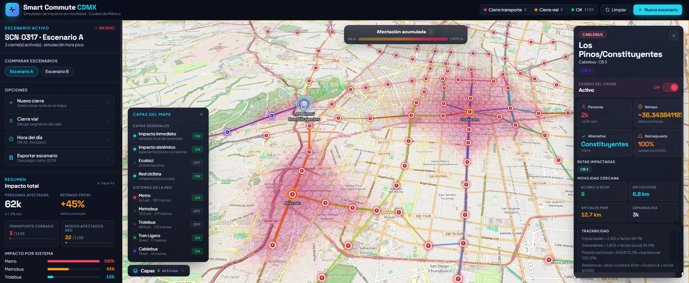

# Claude Impact Lab · Smart Commute CDMX

Smart Commute CDMX es un proyecto de visualizacion de impacto urbano que busca hacer visible, de forma clara y accesible, que pasa cuando se interrumpe infraestructura critica de movilidad en la Ciudad de Mexico.

La idea central del proyecto es permitir que cualquier persona pueda explorar escenarios de cierre de estaciones, lineas o corredores de transporte y entender su efecto potencial sobre la poblacion: cuantas personas quedan afectadas, que zonas se vuelven mas vulnerables y como cambia el acceso a alternativas de movilidad.



## Por que existe este proyecto

Las afectaciones al transporte publico suelen comunicarse como avisos operativos aislados. Este proyecto cambia el enfoque hacia el impacto humano: conecta cierres de movilidad con territorio, cobertura y poblacion para ayudar a comunicar mejor las consecuencias de una interrupcion en la red.

## Contexto

- Desarrollado durante el evento `Claude Impact Lab`
- Enfocado en movilidad urbana y visualizacion civica para la CDMX
- Construido a partir de datos abiertos del Gobierno de la Ciudad de Mexico
- Complementado con fuentes publicas demograficas y geoespaciales para estimar impacto

## Fuentes de datos

El proyecto se alimenta principalmente de datos abiertos y publicos, incluyendo:

- GTFS y datos de transporte publicados por la CDMX
- Datos de afluencia operativa del sistema de transporte
- Capas geoespaciales y cartografia urbana
- Datos demograficos abiertos para estimar poblacion afectada

Portal principal de datos abiertos:

- `https://datos.cdmx.gob.mx/`

Esto permite construir simulaciones y visualizaciones con una base metodologica transparente, reutilizable y verificable.

## Proyecto en linea

Version publicada del proyecto:

- `https://smart-commute-cdmx.vercel.app/`

## Que hay en este repositorio

- `smart-commute-cdmx/` - aplicacion principal
- `docs/` - documentacion del producto y material de referencia

El documento de referencia principal para entender la vision del proyecto es `docs/SmartCommute_CDMX_PRD_v1.md`.

## Vision del proyecto

Smart Commute CDMX busca convertirse en una herramienta publica para comunicar mejor el impacto de cierres de transporte en la ciudad, usando visualizacion, datos abiertos y una narrativa centrada en las personas afectadas, no solo en la infraestructura.

## Como correr el proyecto

La aplicacion principal vive en `smart-commute-cdmx/`.

Pasos rapidos:

```bash
cd smart-commute-cdmx
npm install
npm run dev
```

Para mas detalle tecnico, scripts disponibles y flujo de datos, revisa `smart-commute-cdmx/README.md`.
